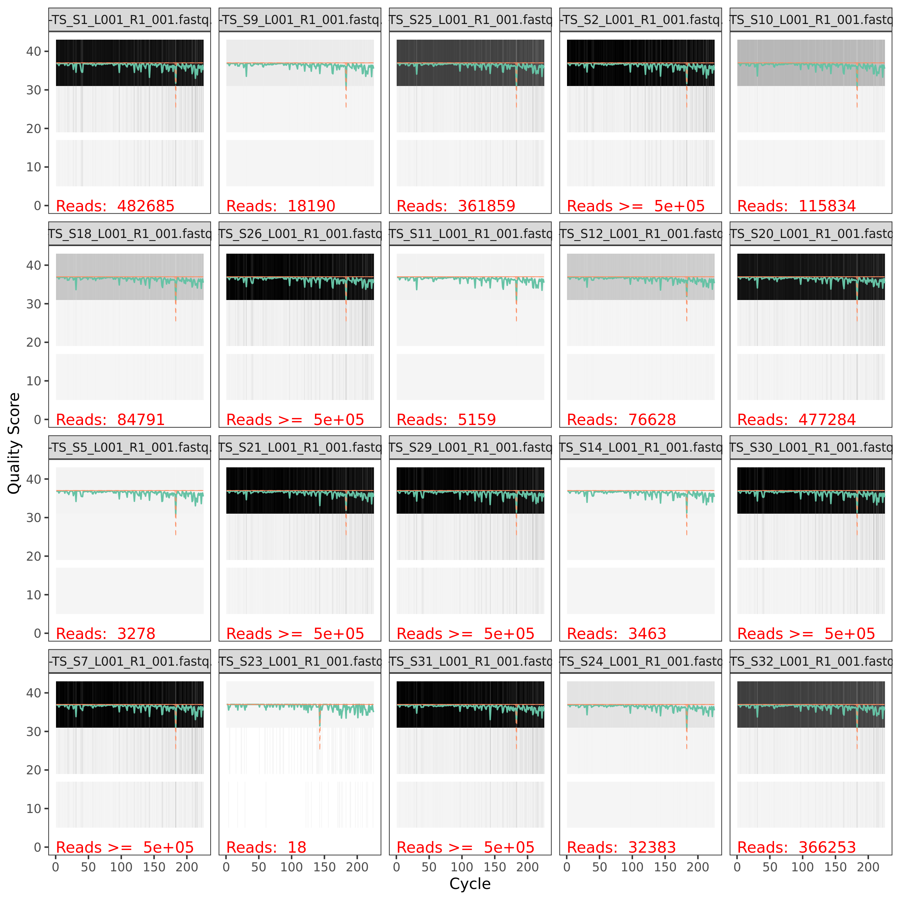
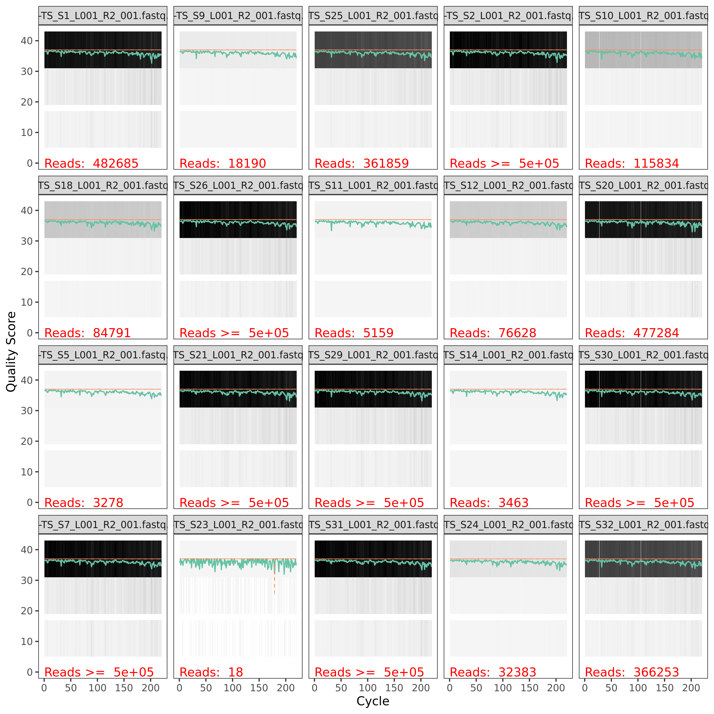
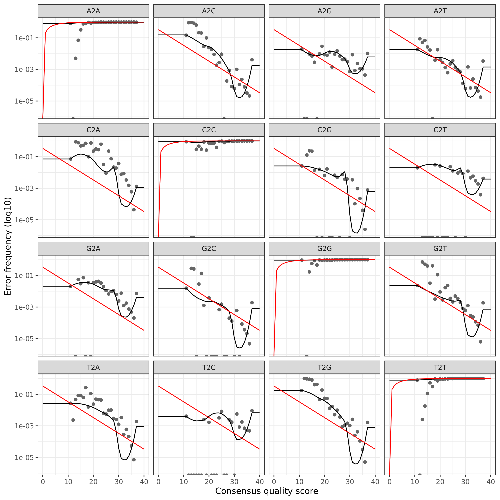
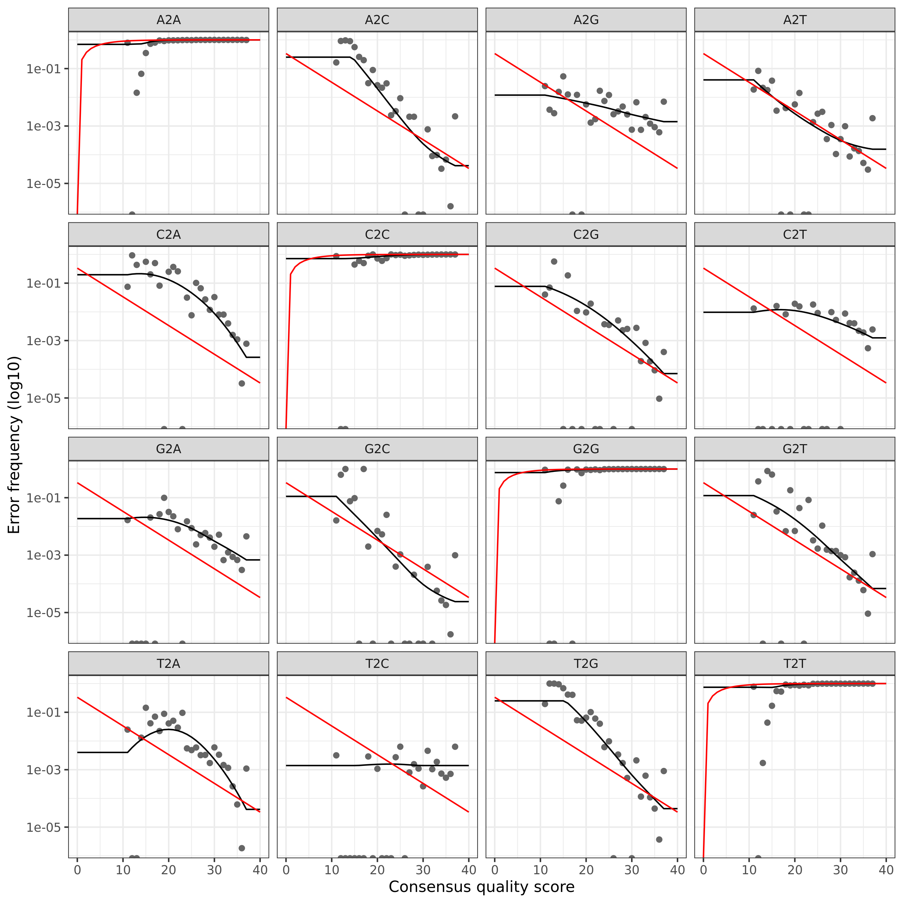
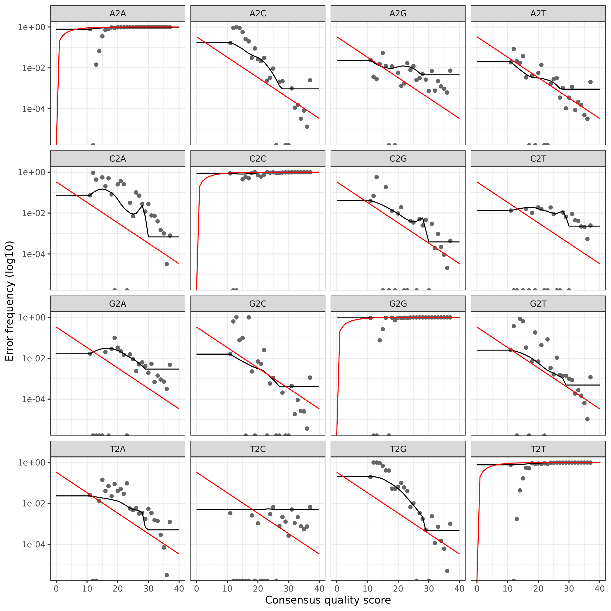
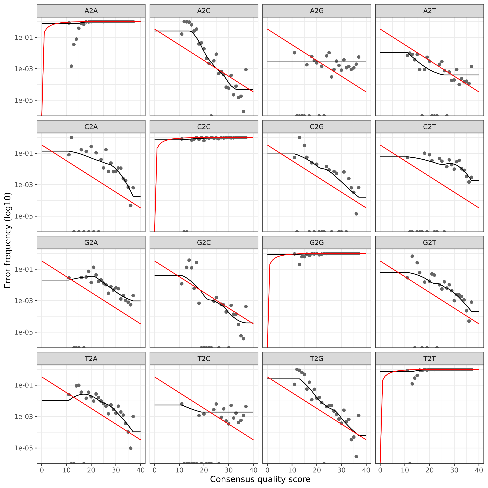

# dada2 tutorial with NovaSeq dataset for Ernakovich Lab

*This tutorial originally created by Angela Oliverio and Hannah
Holland-Moritz. It has been updated for the Ernakovich Lab. Other
contributors to this pipeline include: Corinne Walsh, Matt Gebert, and
Kunkun Fan*  
*Updated October 28, 2021*

This pipeline runs the dada2 workflow for Big Data (paired-end) with
modifications for NovaSeq sequencing base calls

We suggest opening the dada2 tutorial online to understand more about
each step. The original pipeline on which this tutorial is based can be
found here: <https://benjjneb.github.io/dada2/bigdata_paired.html>

| <span>                                                                                                                                                                                                                                                       |
|:-------------------------------------------------------------------------------------------------------------------------------------------------------------------------------------------------------------------------------------------------------------|
| **NOTE:** There is a slightly different pipeline for ITS and non-“Big data” workflows. The non-“Big data” pipeline, in particular, has very nice detailed explanations for each step and can be found here: <https://benjjneb.github.io/dada2/tutorial.html> |
| <span>                                                                                                                                                                                                                                                       |

## Preliminary Checklist (part 0) - Before You Begin

1.  Check to make sure you know what your target ‘AMPLICON’ length. This
    can vary between primer sets, as well as WITHIN primer sets. For
    example, ITS (internal transcribed spacer) amplicon can vary from
    \~100 bps to 300 bps

    For examples regarding commonly used primer sets (515f/806r, Fungal
    ITS2, 1391f/EukBr) see protocols on the Earth Microbiome Project
    website:
    <http://press.igsb.anl.gov/earthmicrobiome/protocols-and-standards/>

2.  Check to make sure you know how long your reads should be (i.e., how
    long should the reads be coming off the sequencer?) This is not the
    same as fragment length, as many times, especially with longer
    fragments, the entire fragment is not being sequenced in one
    direction. When long *amplicons* are not sequenced with a *read
    length* that allows for substantial overlap between the forward and
    reverse read, you can potentially insert biases into the data. If
    you intend to merge your paired end reads, ensure that your read
    length is appropriate. For example, with a MiSeq 2 x 150, 300 cycle
    kit, you will get bidirectional reads of 150 base pairs.

3.  Make note of which sequencing platform was used, as this can impact
    both read quality and downstream analysis. In particular, this
    pipeline is designed to process NovaSeq data which has very
    different quality scores than HiSeq or MiSeq data.

4.  Decide which database is best suited for your analysis needs. Note
    that DADA2 requires databases be in a custom format! If a custom
    database is required, further formatting will be needed to ensure
    that it can run correctly in dada2.

    See the following link for details regarding database formatting:
    <https://benjjneb.github.io/dada2/training.html#formatting-custom-databases>

5.  For additional tutorials and reporting issues, please see link
    below:  
    dada2 tutorial: <https://benjjneb.github.io/dada2/tutorial.html>  
    dada2 pipeline issues\*:
    <https://github.com/fiererlab/dada2_fiererlab/issues>

    \*Note by default, only ‘OPEN’ issues are shown. You can look at all
    issues by removing “is:open” in the search bar at the top.

## Set up (part 1) - Steps before starting pipeline

#### Downloading this tutorial from github

Once you have logged in, you can download a copy of the tutorial into
your directory on the server. To retrieve the folder with this tutorial
from github directly to the server, type the following into your
terminal and hit return after each line.

``` bash
wget https://github.com/ernakovichlab/dada2_ernakovichlab/archive/main.zip
unzip main.zip
```

If there are ever updates to the tutorial on github, you can update the
contents of this folder by downloading the new version from the same
link as above.

#### Setup and install software (you will only need to do this the first time, or if you want to update dada2)

1.  Install the conda environment (this will install all the necessary
    software to run dada2)
2.  First start by cleaning up modules, and then loading the anaconda
    module.

``` bash
module purge
module load anaconda/colsa
```

3.  Next create a conda local environment that you can use to run the
    software. This will install everything you need to run dada2.

``` bash
cd dada2_ernakovichlab
conda env create -f dada2_ernakovich.yml
conda activate dada2_ernakovich
```

| <span>                                                                                                               |
|:---------------------------------------------------------------------------------------------------------------------|
| **WARNING:** This installation may take a long time, so only run this code if you have a fairly large chunk of time! |
| <span>                                                                                                               |

| <span>                                                                                                                                                                                                                                                                                                                                                                                                                                                                                                                                                                                                                                                                                                                                                                                                                                                                                                                                                                                                               |
|:---------------------------------------------------------------------------------------------------------------------------------------------------------------------------------------------------------------------------------------------------------------------------------------------------------------------------------------------------------------------------------------------------------------------------------------------------------------------------------------------------------------------------------------------------------------------------------------------------------------------------------------------------------------------------------------------------------------------------------------------------------------------------------------------------------------------------------------------------------------------------------------------------------------------------------------------------------------------------------------------------------------------|
| **A note about running this on Premise:** To run this on Premise, you will need to submit R-scripts to the job scheduler (slurm). The R scripts in this tutorial can be found in the “R” folder and have been carefully designed so that each step can be run with on slurm with minimal changes. The R scripts are numbered according to their steps. When you are called on to modify a particular step, use a terminal text editor (such as `nano`) to open up the appropriate R script and edit the code accordingly. For your convenience, there is also a folder called “slurm” which contains ready-made slurm scripts that you can use to submit each R script. The slurm scripts are designed to be submitted from the “slurm” folder. You can submit them by using `cd slurm` to navigate into the slurm folder, and `sbatch xxx_dada2_tutorial_16S.slurm` to submit each script. Throughout this pipeline you will see **STOP** notices. These indicate how you should modify the R script at each stage. |
| <span>                                                                                                                                                                                                                                                                                                                                                                                                                                                                                                                                                                                                                                                                                                                                                                                                                                                                                                                                                                                                               |

If you are running it on your own computer (runs slower!):

1.  Download this tutorial from github. Go to [the
    homepage](https://github.com/fiererlab/dada2_fiererlab/dada2_fiererlab),
    and click the green “Clone or download” button. Then click “Download
    ZIP”, to save it to your computer. Unzip the file to access the
    R-script.

2.  Download the tutorial data from here
    <http://cme.colorado.edu/projects/bioinformatics-tutorials>

3.  Install cutadapt. If you are using conda, you may also use the .yml
    file to create an environment with cutadapt and all the necessary R
    packages pre-installed

    -   cutadapt can be installed from here:
        <https://cutadapt.readthedocs.io/en/stable/installation.html>

4.  Download the dada2-formatted reference database of your choice. Link
    to download here: <https://benjjneb.github.io/dada2/training.html>

5.  Open the Rmarkdown script in Rstudio. The script is located in the
    tutorial folder you downloaded in the first step. You can navigate
    to the proper folder in Rstudio by clicking on the files tab and
    navigating to the location where you downloaded the github folder.
    Then click dada2_ernakovichlab and dada2_tutorial_16S_all.Rmd to
    open the script.

Now, install DADA2 & other necessary packages(if you haven’t opted for
the conda option). Depending on how you set up Rstudio, you might get a
prompt asking if you want to create your own library. Answer ‘yes’ twice
in the console to continue.

| <span>                                                                                                                  |
|:------------------------------------------------------------------------------------------------------------------------|
| **WARNING:** This installation may take a long time, so only run this code if these packages are not already installed! |
| <span>                                                                                                                  |

``` r
install.packages("BiocManager")
BiocManager::install("dada2", version = "3.8")

source("https://bioconductor.org/biocLite.R")
biocLite("ShortRead")
install.packages("dplyr")
install.packages("tidyr")
install.packages("Hmisc")
install.packages("ggplot2")
install.packages("plotly")
```

Once the packages are installed, you can check to make sure the
auxiliary software is working and set up some of the variables that you
will need along the way.

| <span>                                                                                                                                               |
|:-----------------------------------------------------------------------------------------------------------------------------------------------------|
| **NOTE:** If you are not working from premise, you will need to change the file paths for cutadapt to where they are stored on your computer/server. |
| <span>                                                                                                                                               |

For this tutorial we will be working with some samples that we obtained
16S amplicon data for, from a Illumina Miseq run. The data for these
samples can be found on the CME website.
<http://cme.colorado.edu/projects/bioinformatics-tutorials>

## Set up (part 2) - You are logged in to premise (or have Rstudio open on your computer)

First load and test the installed packages to make sure they’re working

Load DADA2 and required packages

``` r
library(dada2); packageVersion("dada2") # the dada2 pipeline
## [1] '1.20.0'
library(ShortRead); packageVersion("ShortRead") # dada2 depends on this
## [1] '1.50.0'
library(dplyr); packageVersion("dplyr") # for manipulating data
## [1] '1.0.7'
library(tidyr); packageVersion("tidyr") # for creating the final graph at the end of the pipeline
## [1] '1.1.4'
library(Hmisc); packageVersion("Hmisc") # for creating the final graph at the end of the pipeline
## [1] '4.6.0'
library(ggplot2); packageVersion("ggplot2") # for creating the final graph at the end of the pipeline
## [1] '3.3.5'
library(plotly); packageVersion("plotly") # enables creation of interactive graphs, especially helpful for quality plots
## [1] '4.10.0'

# Set up pathway to cutadapt (primer trimming tool) and test
cutadapt <- "cutadapt" # CHANGE ME if not on premise; will probably look something like this: "/usr/local/Python27/bin/cutadapt"
system2(cutadapt, args = "--version") # Check by running shell command from R
```

We will now set up the directories for the script. We’ll tell the script
where our data is, and where we want to put the outputs of the script.
We highly recommend NOT putting outputs of this script directly into
your home directory, or into this tutorial directory. A better idea is
to create a new project directory to hold the output each project you
work on.

``` r
# Set path to shared data folder and contents
data.fp <- "/mnt/home/ernakovich/shared/dada2_tutorial_data/16S"

# List all files in shared folder to check path
list.files(data.fp)
##  [1] "1aT_9-8_16S_S6_L002_R1_001.fastq.gz" 
##  [2] "1aT_9-8_16S_S6_L002_R2_001.fastq.gz" 
##  [3] "1b_9-17_16S_S2_L002_R1_001.fastq.gz" 
##  [4] "1b_9-17_16S_S2_L002_R2_001.fastq.gz" 
##  [5] "1c_9-17_16S_S3_L002_R1_001.fastq.gz" 
##  [6] "1c_9-17_16S_S3_L002_R2_001.fastq.gz" 
##  [7] "1cT_9-3_16S_S8_L002_R1_001.fastq.gz" 
##  [8] "1cT_9-3_16S_S8_L002_R2_001.fastq.gz" 
##  [9] "1d_9-17_16S_S4_L002_R1_001.fastq.gz" 
## [10] "1d_9-17_16S_S4_L002_R2_001.fastq.gz" 
## [11] "1dT_9-3_16S_S9_L002_R1_001.fastq.gz" 
## [12] "1dT_9-3_16S_S9_L002_R2_001.fastq.gz" 
## [13] "1eT_9-3_16S_S10_L002_R1_001.fastq.gz"
## [14] "1eT_9-3_16S_S10_L002_R2_001.fastq.gz"

# Set file paths for barcodes file, map file, and fastqs
# Barcodes need to have 'N' on the end of each 12bp sequence for compatability
#map.fp <- file.path(data.fp, "Molecular_Methods_18_515fBC_16S_Mapping_File_SHORT_vFinal_Fierer_10252018.txt")
```

Set up file paths in YOUR directory where you want data; you do not need
to create the sub-directories but they are nice to have for
organizational purposes.

``` r
project.fp <- "~/dada2_tutorial_test" # CHANGE ME to project directory; don't append with a "/"

dir.create(project.fp)

# Set up names of sub directories to stay organized
preprocess.fp <- file.path(project.fp, "01_preprocess")
filtN.fp <- file.path(preprocess.fp, "filtN")
trimmed.fp <- file.path(preprocess.fp, "trimmed")
filter.fp <- file.path(project.fp, "02_filter") 
table.fp <- file.path(project.fp, "03_tabletax") 
```

| <span>                                                                                                                                                                                                                         |
|:-------------------------------------------------------------------------------------------------------------------------------------------------------------------------------------------------------------------------------|
| **STOP - 00_setup_dada2_tutorial_16S.R:** If you are running this on Premise, open up the 00_setup_dada2_tutorial_16S.R script with nano (or your favorite terminal text editor) and adjust the filepaths above appropriately. |
| <span>                                                                                                                                                                                                                         |

## Pre-processing data for dada2 - remove sequences with Ns, cutadapt

``` r
# Get full paths for all files and save them for downstream analyses
# Forward and reverse fastq filenames have format: 
fnFs <- sort(list.files(data.fp, pattern="R1_", full.names = TRUE))
fnRs <- sort(list.files(data.fp, pattern="R2_", full.names = TRUE))
```

#### Pre-filter to remove sequence reads with Ns

Ambiguous bases will make it hard for cutadapt to find short primer
sequences in the reads. To solve this problem, we will remove sequences
with ambiguous bases (Ns)

``` r
# Name the N-filtered files to put them in filtN/ subdirectory
fnFs.filtN <- file.path(preprocess.fp, "filtN", basename(fnFs))
fnRs.filtN <- file.path(preprocess.fp, "filtN", basename(fnRs))

# Filter Ns from reads and put them into the filtN directory
filterAndTrim(fnFs, fnFs.filtN, fnRs, fnRs.filtN, maxN = 0, multithread = TRUE) 
# CHANGE multithread to FALSE on Windows (here and elsewhere in the program)
```

| <span>                                                                                                                                                                                       |
|:---------------------------------------------------------------------------------------------------------------------------------------------------------------------------------------------|
| **Note:** The `multithread = TRUE` setting can sometimes generate an error (names not equal). If this occurs, try rerunning the function. The error normally does not occur the second time. |
| <span>                                                                                                                                                                                       |

#### Prepare the primers sequences and custom functions for analyzing the results from cutadapt

Assign the primers you used to “FWD” and “REV” below. Note primers
should be not be reverse complemented ahead of time. Our tutorial data
uses 515f and 926r those are the primers below. Change if you sequenced
with other primers.

**For ITS data:** `CTTGGTCATTTAGAGGAAGTAA` is the ITS forward primer
sequence (ITS1F) and `GCTGCGTTCTTCATCGATGC` is ITS reverse primer
sequence (ITS2). Using cutadapt to remove these primers will allow us to
retain ITS sequences of variable biological length. See the dada2
creators’ ITS tutorial for more details.

``` r
# Set up the primer sequences to pass along to cutadapt
FWD <- "GTGYCAGCMGCCGCGGTAA"  ## CHANGE ME # this is 515f
REV <- "CCGYCAATTYMTTTRAGTTT"  ## CHANGE ME # this is 926r

# Write a function that creates a list of all orientations of the primers
allOrients <- function(primer) {
  # Create all orientations of the input sequence
  require(Biostrings)
  dna <- DNAString(primer)  # The Biostrings works w/ DNAString objects rather than character vectors
  orients <- c(Forward = dna, Complement = complement(dna), Reverse = reverse(dna), 
               RevComp = reverseComplement(dna))
  return(sapply(orients, toString))  # Convert back to character vector
}

# Save the primer orientations to pass to cutadapt
FWD.orients <- allOrients(FWD)
REV.orients <- allOrients(REV)
FWD.orients
##               Forward            Complement               Reverse 
## "GTGYCAGCMGCCGCGGTAA" "CACRGTCGKCGGCGCCATT" "AATGGCGCCGMCGACYGTG" 
##               RevComp 
## "TTACCGCGGCKGCTGRCAC"

# Write a function that counts how many time primers appear in a sequence
primerHits <- function(primer, fn) {
  # Counts number of reads in which the primer is found
  nhits <- vcountPattern(primer, sread(readFastq(fn)), fixed = FALSE)
  return(sum(nhits > 0))
}
```

Before running cutadapt, we will look at primer detection for the first
sample, as a check. There may be some primers here, we will remove them
below using cutadapt.

``` r
rbind(FWD.ForwardReads = sapply(FWD.orients, primerHits, fn = fnFs.filtN[[1]]), 
      FWD.ReverseReads = sapply(FWD.orients, primerHits, fn = fnRs.filtN[[1]]), 
      REV.ForwardReads = sapply(REV.orients, primerHits, fn = fnFs.filtN[[1]]), 
      REV.ReverseReads = sapply(REV.orients, primerHits, fn = fnRs.filtN[[1]]))
##                  Forward Complement Reverse RevComp
## FWD.ForwardReads  248774          0       0       0
## FWD.ReverseReads       0          0       0      59
## REV.ForwardReads       0          0       0      60
## REV.ReverseReads  245351          0       0       0
```

#### Remove primers with cutadapt and assess the output

``` r
# Create directory to hold the output from cutadapt
if (!dir.exists(trimmed.fp)) dir.create(trimmed.fp)
fnFs.cut <- file.path(trimmed.fp, basename(fnFs))
fnRs.cut <- file.path(trimmed.fp, basename(fnRs))

# Save the reverse complements of the primers to variables
FWD.RC <- dada2:::rc(FWD)
REV.RC <- dada2:::rc(REV)

##  Create the cutadapt flags ##
# Trim FWD and the reverse-complement of REV off of R1 (forward reads)
R1.flags <- paste("-g", FWD, "-a", REV.RC, "--minimum-length 50") 

# Trim REV and the reverse-complement of FWD off of R2 (reverse reads)
R2.flags <- paste("-G", REV, "-A", FWD.RC, "--minimum-length 50") 

# Run Cutadapt
for (i in seq_along(fnFs)) {
  system2(cutadapt, args = c("-j", 0, R1.flags, R2.flags, "-n", 2, # -n 2 required to remove FWD and REV from reads
                             "-o", fnFs.cut[i], "-p", fnRs.cut[i], # output files
                             fnFs.filtN[i], fnRs.filtN[i])) # input files
}

# As a sanity check, we will check for primers in the first cutadapt-ed sample:
## should all be zero!
rbind(FWD.ForwardReads = sapply(FWD.orients, primerHits, fn = fnFs.cut[[1]]), 
      FWD.ReverseReads = sapply(FWD.orients, primerHits, fn = fnRs.cut[[1]]), 
      REV.ForwardReads = sapply(REV.orients, primerHits, fn = fnFs.cut[[1]]), 
      REV.ReverseReads = sapply(REV.orients, primerHits, fn = fnRs.cut[[1]]))
##                  Forward Complement Reverse RevComp
## FWD.ForwardReads       0          0       0       0
## FWD.ReverseReads       0          0       0       0
## REV.ForwardReads       0          0       0       0
## REV.ReverseReads       0          0       0       0
```

| <span>                                                                                                                                                                                                                                                                                                                                              |
|:----------------------------------------------------------------------------------------------------------------------------------------------------------------------------------------------------------------------------------------------------------------------------------------------------------------------------------------------------|
| **STOP - 01_pre-process_dada2_tutorial_16S.R:** If you are running this on Premise, open up the 01_pre-process_dada2_tutorial_16S.R script with `nano` (or your favorite terminal text editor) and adjust the primer sequences (if need be). After running it, check the slurm output to make sure that there are no primers still in your samples. |
| <span>                                                                                                                                                                                                                                                                                                                                              |

# Now start DADA2 pipeline

``` r
# Put filtered reads into separate sub-directories for big data workflow
dir.create(filter.fp)
subF.fp <- file.path(filter.fp, "preprocessed_F") 
subR.fp <- file.path(filter.fp, "preprocessed_R") 
dir.create(subF.fp)
dir.create(subR.fp)

# Move R1 and R2 from trimmed to separate forward/reverse sub-directories
fnFs.Q <- file.path(subF.fp,  basename(fnFs)) 
fnRs.Q <- file.path(subR.fp,  basename(fnRs))
file.copy(from = fnFs.cut, to = fnFs.Q)
## [1] FALSE FALSE FALSE FALSE FALSE FALSE FALSE
file.copy(from = fnRs.cut, to = fnRs.Q)
## [1] FALSE FALSE FALSE FALSE FALSE FALSE FALSE

# File parsing; create file names and make sure that forward and reverse files match
filtpathF <- file.path(subF.fp, "filtered") # files go into preprocessed_F/filtered/
filtpathR <- file.path(subR.fp, "filtered") # ...
fastqFs <- sort(list.files(subF.fp, pattern="fastq.gz"))
fastqRs <- sort(list.files(subR.fp, pattern="fastq.gz"))
if(length(fastqFs) != length(fastqRs)) stop("Forward and reverse files do not match.")
```

### 1. FILTER AND TRIM FOR QUALITY

Before chosing sequence variants, we want to trim reads where their
quality scores begin to drop (the `truncLen` and `truncQ` values) and
remove any low-quality reads that are left over after we have finished
trimming (the `maxEE` value).

**You will want to change this depending on run chemistry and quality:**
For 2x250 bp runs you can try `truncLen=c(240,160)` (as per the [dada2
tutorial](https://benjjneb.github.io/dada2/tutorial.html#inspect-read-quality-profiles))
if your reverse reads drop off in quality. Or you may want to choose a
higher value, for example, `truncLen=c(240,200)`, if they do not. In
`truncLen=c(xxx,yyy)`, `xxx` refers to the forward read truncation
length, `yyy` refers to the reverse read truncation length.

**For ITS data:** Due to the expected variable read lengths in ITS data
you should run this command without the `trunclen` parameter. See here
for more information and appropriate parameters for ITS data:
<https://benjjneb.github.io/dada2/ITS_workflow.html>.

*From dada2 tutorial:* \>If there is only one part of any amplicon
bioinformatics workflow on which you spend time considering the
parameters, it should be filtering! The parameters … are not set in
stone, and should be changed if they don’t work for your data. If too
few reads are passing the filter, increase maxEE and/or reduce truncQ.
If quality drops sharply at the end of your reads, reduce truncLen. If
your reads are high quality and you want to reduce computation time in
the sample inference step, reduce maxEE.

#### Inspect read quality profiles

It’s important to get a feel for the quality of the data that we are
using. To do this, we will plot the quality of some of the samples.

*From the dada2 tutorial:* \>In gray-scale is a heat map of the
frequency of each quality score at each base position. The median
quality score at each position is shown by the green line, and the
quartiles of the quality score distribution by the orange lines. The red
line shows the scaled proportion of reads that extend to at least that
position (this is more useful for other sequencing technologies, as
Illumina reads are typically all the same length, hence the flat red
line).

``` r
# If the number of samples is 20 or less, plot them all, otherwise, just plot 20 randomly selected samples
if( length(fastqFs) <= 20) {
  fwd_qual_plots <- plotQualityProfile(paste0(subF.fp, "/", fastqFs))
  rev_qual_plots <- plotQualityProfile(paste0(subR.fp, "/", fastqRs))
} else {
  rand_samples <- sample(size = 20, 1:length(fastqFs)) # grab 20 random samples to plot
  fwd_qual_plots <- plotQualityProfile(paste0(subF.fp, "/", fastqFs[rand_samples]))
  rev_qual_plots <- plotQualityProfile(paste0(subR.fp, "/", fastqRs[rand_samples]))
}

fwd_qual_plots
```


``` r
rev_qual_plots
```


``` r
# Or, to make these quality plots interactive, just call the plots through plotly
ggplotly(fwd_qual_plots)
ggplotly(rev_qual_plots)
```

``` r
# write plots to disk
saveRDS(fwd_qual_plots, paste0(filter.fp, "/fwd_qual_plots.rds"))
saveRDS(rev_qual_plots, paste0(filter.fp, "/rev_qual_plots.rds"))

ggsave(plot = fwd_qual_plots, filename = paste0(filter.fp, "/fwd_qual_plots.png"), 
       width = 10, height = 10, dpi = "retina")
ggsave(plot = rev_qual_plots, filename = paste0(filter.fp, "/rev_qual_plots.png"), 
       width = 10, height = 10, dpi = "retina")
```

| <span>                                                                                                                                                                                                                                                                                                     |
|:-----------------------------------------------------------------------------------------------------------------------------------------------------------------------------------------------------------------------------------------------------------------------------------------------------------|
| **STOP - 02_check_quality_dada2_tutorial.R:** If you are running this on Premise, run this script and download the plots generated here (fwd_qual_plots.png and rev_qual_plots.png). These are the pre-filtering plots, you should use them to make decisions for your filtering choices in the next step. |
| <span>                                                                                                                                                                                                                                                                                                     |

#### Filter the data

| <span>                                                                                                                                                                                                                                                                                                                                                      |
|:------------------------------------------------------------------------------------------------------------------------------------------------------------------------------------------------------------------------------------------------------------------------------------------------------------------------------------------------------------|
| **WARNING:** THESE PARAMETERS ARE NOT OPTIMAL FOR ALL DATASETS. Make sure you determine the trim and filtering parameters for your data. The following settings may be generally appropriate for NovaSeq runs that are 2x250 bp. For more information you can check the recommended default parameters from the dada2 pipeline. See above for more details. |
| <span>                                                                                                                                                                                                                                                                                                                                                      |

``` r
filt_out <- filterAndTrim(fwd=file.path(subF.fp, fastqFs), filt=file.path(filtpathF, fastqFs),
                          rev=file.path(subR.fp, fastqRs), filt.rev=file.path(filtpathR, fastqRs),
                          truncLen=c(225,220), maxEE=c(2,2), truncQ=2, maxN=0, rm.phix=TRUE,
                          compress=TRUE, verbose=TRUE, multithread=TRUE)

# look at how many reads were kept
head(filt_out)
##                                     reads.in reads.out
## 1aT_9-8_16S_S6_L002_R1_001.fastq.gz   257533    204288
## 1b_9-17_16S_S2_L002_R1_001.fastq.gz   251087    196135
## 1c_9-17_16S_S3_L002_R1_001.fastq.gz   139919    109428
## 1cT_9-3_16S_S8_L002_R1_001.fastq.gz   225774    176224
## 1d_9-17_16S_S4_L002_R1_001.fastq.gz   244042    196681
## 1dT_9-3_16S_S9_L002_R1_001.fastq.gz   289003    228879

# summary of samples in filt_out by percentage
filt_out %>% 
  data.frame() %>% 
  mutate(Samples = rownames(.),
         percent_kept = 100*(reads.out/reads.in)) %>%
  select(Samples, everything()) %>%
  summarise(min_remaining = paste0(round(min(percent_kept), 2), "%"), 
            median_remaining = paste0(round(median(percent_kept), 2), "%"),
            mean_remaining = paste0(round(mean(percent_kept), 2), "%"), 
            max_remaining = paste0(round(max(percent_kept), 2), "%"))
##   min_remaining median_remaining mean_remaining max_remaining
## 1        72.97%           78.21%         78.07%        80.59%
```

Plot the quality of the filtered fastq files.

``` r
# If the number of samples greater than 20 figure out which samples, if any, have been filtered out
# so we won't try to plot them, otherwise just plot all the samples that remain
if( length(fastqFs) <= 20) {
  remaining_samplesF <-  fastqFs[
    which(fastqFs %in% list.files(filtpathF))] # keep only samples that haven't been filtered out
  remaining_samplesR <-  fastqRs[
    which(fastqRs %in% list.files(filtpathR))] # keep only samples that haven't been filtered out

  fwd_qual_plots_filt <- plotQualityProfile(paste0(filtpathF, "/", remaining_samplesF))
  rev_qual_plots_filt <- plotQualityProfile(paste0(filtpathR, "/", remaining_samplesR))
} else {
  remaining_samplesF <-  fastqFs[rand_samples][
    which(fastqFs[rand_samples] %in% list.files(filtpathF))] # keep only samples that haven't been filtered out
  remaining_samplesR <-  fastqRs[rand_samples][
    which(fastqRs[rand_samples] %in% list.files(filtpathR))] # keep only samples that haven't been filtered out
  fwd_qual_plots_filt <- plotQualityProfile(paste0(filtpathF, "/", remaining_samplesF))
  rev_qual_plots_filt <- plotQualityProfile(paste0(filtpathR, "/", remaining_samplesR))
}

fwd_qual_plots_filt
```



``` r
rev_qual_plots_filt
```



``` r
# write plots to disk
saveRDS(fwd_qual_plots_filt, paste0(filter.fp, "/fwd_qual_plots_filt.rds"))
saveRDS(rev_qual_plots_filt, paste0(filter.fp, "/rev_qual_plots_filt.rds"))

ggsave(plot = fwd_qual_plots_filt, filename = paste0(filter.fp, "/fwd_qual_plots_filt.png"), 
       width = 10, height = 10, dpi = "retina")
ggsave(plot = rev_qual_plots_filt, filename = paste0(filter.fp, "/rev_qual_plots_filt.png"), 
       width = 10, height = 10, dpi = "retina")
```

| <span>                                                                                                                                                                                                                                                                                                                   |
|:-------------------------------------------------------------------------------------------------------------------------------------------------------------------------------------------------------------------------------------------------------------------------------------------------------------------------|
| **STOP - 03_filter_reads_dada2_tutorial_16S.R:** If you are running this on Premise, download the plots generated here (fwd_qual_plots_filt.png and rev_qual_plots_filt.png) and verify that your filtering is working the way you want it. If not, adjust the filterAndTrim() function and re-run this step with slurm. |
| <span>                                                                                                                                                                                                                                                                                                                   |

### 2. INFER sequence variants

In this part of the pipeline dada2 will learn to distinguish error from
biological differences using a subset of our data as a training set.
After it understands the error rates, we will reduce the size of the
dataset by combining all identical sequence reads into “unique
sequences”. Then, using the dereplicated data and error rates, dada2
will infer the sequence variants (OTUs) in our data. Finally, we will
merge the coresponding forward and reverse reads to create a list of the
fully denoised sequences and create a sequence table from the result.

#### Housekeeping step - set up and verify the file names for the output:

``` r
# File parsing
filtFs <- list.files(filtpathF, pattern="fastq.gz", full.names = TRUE)
filtRs <- list.files(filtpathR, pattern="fastq.gz", full.names = TRUE)

# Sample names in order
sample.names <- basename(filtFs) # doesn't drop fastq.gz
sample.names <- gsub("_R1_001.fastq.gz", "", sample.names)
sample.namesR <- basename(filtRs) # doesn't drop fastq.gz 
sample.namesR <- gsub("_R2_001.fastq.gz", "", sample.namesR)

# Double check
if(!identical(sample.names, sample.namesR)) stop("Forward and reverse files do not match.")
names(filtFs) <- sample.names
names(filtRs) <- sample.names
```

#### Learn the error rates

In this step we will learn the error rates for the sequencing run.
Typically dada2 expects you to have data that has HiSeq or MiSeq-style
quality scores - that is quality scores that range from 0-40. However,
NovaSeq uses a technique called “binned” quality scores. This means that
as quality scores are calculated from the sequencer, instead of
assigning them a number between 0 and 40, they are instead assigned to 4
different quality scores, typically 0-40 scores are converted as shown
below:

0-2 -> 2  
3-14 -> 11  
15-30 -> 25  
31-40 -> 37

This means that the `learnErrors` function has 1/10th of the information
that it usually uses to learn the appropriate error function, which
often leads to error plots with characteristic troughs in odd places.
Although a definitive solution to this has not been found yet, several
have been [proposed](https://github.com/benjjneb/dada2/issues/1307).
Typically UNH sequencing data will be NovaSeq data, but it’s good to
check. If you have data that doesn’t have binned error scores
(i.e. MiSeq or HiSeq data) you can proceed to learn error rates in the
typical way, and not worry about the modifications below. (Use `errF`
and `errR` for the sequence-variant identification in the next step.)
Otherwise, you should carefully inspect the error plots generated by
each method below and choose the one that looks the best. Error rate
plots that look good have black points that are very close to the black
line and are continuously decreasing (especially in the right side of
the plot).

``` r
set.seed(100) # set seed to ensure that randomized steps are replicatable
```

##### Traditional way of learning error rates

``` r
# Learn forward error rates (Notes: randomize default is FALSE)
errF <- learnErrors(filtFs, nbases = 1e10, multithread = TRUE, randomize = TRUE)
## 287310600 total bases in 1276936 reads from 7 samples will be used for learning the error rates.

# Learn reverse error rates
errR <- learnErrors(filtRs, nbases = 1e10, multithread = TRUE, randomize = TRUE)
## 280925920 total bases in 1276936 reads from 7 samples will be used for learning the error rates.

saveRDS(errF, paste0(filtpathF, "/errF.rds"))
saveRDS(errR, paste0(filtpathR, "/errR.rds"))
```

##### Four options for learning error rates with NovaSeq data

**Option 1** from JacobRPrice alter loess arguments (weights and span
and enforce monotonicity)  
<https://github.com/benjjneb/dada2/issues/1307>

``` r
loessErrfun_mod1 <- function(trans) {
  qq <- as.numeric(colnames(trans))
  est <- matrix(0, nrow=0, ncol=length(qq))
  for(nti in c("A","C","G","T")) {
    for(ntj in c("A","C","G","T")) {
      if(nti != ntj) {
        errs <- trans[paste0(nti,"2",ntj),]
        tot <- colSums(trans[paste0(nti,"2",c("A","C","G","T")),])
        rlogp <- log10((errs+1)/tot)  # 1 psuedocount for each err, but if tot=0 will give NA
        rlogp[is.infinite(rlogp)] <- NA
        df <- data.frame(q=qq, errs=errs, tot=tot, rlogp=rlogp)
        
        # original
        # ###! mod.lo <- loess(rlogp ~ q, df, weights=errs) ###!
        # mod.lo <- loess(rlogp ~ q, df, weights=tot) ###!
        # #        mod.lo <- loess(rlogp ~ q, df)
        
        # Gulliem Salazar's solution
        # https://github.com/benjjneb/dada2/issues/938
        mod.lo <- loess(rlogp ~ q, df, weights = log10(tot),span = 2)
        
        pred <- predict(mod.lo, qq)
        maxrli <- max(which(!is.na(pred)))
        minrli <- min(which(!is.na(pred)))
        pred[seq_along(pred)>maxrli] <- pred[[maxrli]]
        pred[seq_along(pred)<minrli] <- pred[[minrli]]
        est <- rbind(est, 10^pred)
      } # if(nti != ntj)
    } # for(ntj in c("A","C","G","T"))
  } # for(nti in c("A","C","G","T"))
  
  # HACKY
  MAX_ERROR_RATE <- 0.25
  MIN_ERROR_RATE <- 1e-7
  est[est>MAX_ERROR_RATE] <- MAX_ERROR_RATE
  est[est<MIN_ERROR_RATE] <- MIN_ERROR_RATE
  
  # enforce monotonicity
  # https://github.com/benjjneb/dada2/issues/791
  estorig <- est
  est <- est %>%
    data.frame() %>%
    mutate_all(funs(case_when(. < X40 ~ X40,
                              . >= X40 ~ .))) %>% as.matrix()
  rownames(est) <- rownames(estorig)
  colnames(est) <- colnames(estorig)
  
  # Expand the err matrix with the self-transition probs
  err <- rbind(1-colSums(est[1:3,]), est[1:3,],
               est[4,], 1-colSums(est[4:6,]), est[5:6,],
               est[7:8,], 1-colSums(est[7:9,]), est[9,],
               est[10:12,], 1-colSums(est[10:12,]))
  rownames(err) <- paste0(rep(c("A","C","G","T"), each=4), "2", c("A","C","G","T"))
  colnames(err) <- colnames(trans)
  # Return
  return(err)
}

# check what this looks like
errF_1 <- learnErrors(
  filtFs,
  multithread = TRUE,
  nbases = 1e10,
  errorEstimationFunction = loessErrfun_mod1,
  verbose = TRUE
)
## 287310600 total bases in 1276936 reads from 7 samples will be used for learning the error rates.
## Initializing error rates to maximum possible estimate.
## selfConsist step 1 .......
##    selfConsist step 2
##    selfConsist step 3
##    selfConsist step 4
##    selfConsist step 5
##    selfConsist step 6
##    selfConsist step 7
##    selfConsist step 8
##    selfConsist step 9
##    selfConsist step 10
errR_1 <- learnErrors(
  filtRs,
  multithread = TRUE,
  nbases = 1e10,
  errorEstimationFunction = loessErrfun_mod1,
  verbose = TRUE
)
## 280925920 total bases in 1276936 reads from 7 samples will be used for learning the error rates.
## Initializing error rates to maximum possible estimate.
## selfConsist step 1 .......
##    selfConsist step 2
##    selfConsist step 3
##    selfConsist step 4
##    selfConsist step 5
##    selfConsist step 6
##    selfConsist step 7
##    selfConsist step 8
##    selfConsist step 9
##    selfConsist step 10
```

**Option 2** enforce monotonicity only.  
Originally recommended in:
<https://github.com/benjjneb/dada2/issues/791>

``` r
loessErrfun_mod2 <- function(trans) {
  qq <- as.numeric(colnames(trans))
  est <- matrix(0, nrow=0, ncol=length(qq))
  for(nti in c("A","C","G","T")) {
    for(ntj in c("A","C","G","T")) {
      if(nti != ntj) {
        errs <- trans[paste0(nti,"2",ntj),]
        tot <- colSums(trans[paste0(nti,"2",c("A","C","G","T")),])
        rlogp <- log10((errs+1)/tot)  # 1 psuedocount for each err, but if tot=0 will give NA
        rlogp[is.infinite(rlogp)] <- NA
        df <- data.frame(q=qq, errs=errs, tot=tot, rlogp=rlogp)
        
        # original
        # ###! mod.lo <- loess(rlogp ~ q, df, weights=errs) ###!
        mod.lo <- loess(rlogp ~ q, df, weights=tot) ###!
        # #        mod.lo <- loess(rlogp ~ q, df)
        
        # Gulliem Salazar's solution
        # https://github.com/benjjneb/dada2/issues/938
        # mod.lo <- loess(rlogp ~ q, df, weights = log10(tot),span = 2)
        
        pred <- predict(mod.lo, qq)
        maxrli <- max(which(!is.na(pred)))
        minrli <- min(which(!is.na(pred)))
        pred[seq_along(pred)>maxrli] <- pred[[maxrli]]
        pred[seq_along(pred)<minrli] <- pred[[minrli]]
        est <- rbind(est, 10^pred)
      } # if(nti != ntj)
    } # for(ntj in c("A","C","G","T"))
  } # for(nti in c("A","C","G","T"))
  
  # HACKY
  MAX_ERROR_RATE <- 0.25
  MIN_ERROR_RATE <- 1e-7
  est[est>MAX_ERROR_RATE] <- MAX_ERROR_RATE
  est[est<MIN_ERROR_RATE] <- MIN_ERROR_RATE
  
  # enforce monotonicity
  # https://github.com/benjjneb/dada2/issues/791
  estorig <- est
  est <- est %>%
    data.frame() %>%
    mutate_all(funs(case_when(. < X40 ~ X40,
                              . >= X40 ~ .))) %>% as.matrix()
  rownames(est) <- rownames(estorig)
  colnames(est) <- colnames(estorig)
  
  # Expand the err matrix with the self-transition probs
  err <- rbind(1-colSums(est[1:3,]), est[1:3,],
               est[4,], 1-colSums(est[4:6,]), est[5:6,],
               est[7:8,], 1-colSums(est[7:9,]), est[9,],
               est[10:12,], 1-colSums(est[10:12,]))
  rownames(err) <- paste0(rep(c("A","C","G","T"), each=4), "2", c("A","C","G","T"))
  colnames(err) <- colnames(trans)
  # Return
  return(err)
}


# check what this looks like
errF_2 <- learnErrors(
  filtFs,
  multithread = TRUE,
  nbases = 1e10,
  errorEstimationFunction = loessErrfun_mod2,
  verbose = TRUE
)
## 287310600 total bases in 1276936 reads from 7 samples will be used for learning the error rates.
## Initializing error rates to maximum possible estimate.
## selfConsist step 1 .......
##    selfConsist step 2
##    selfConsist step 3
##    selfConsist step 4
##    selfConsist step 5
##    selfConsist step 6
##    selfConsist step 7
##    selfConsist step 8
## Convergence after  8  rounds.

errR_2 <- learnErrors(
  filtRs,
  multithread = TRUE,
  nbases = 1e10,
  errorEstimationFunction = loessErrfun_mod2,
  verbose = TRUE
)
## 280925920 total bases in 1276936 reads from 7 samples will be used for learning the error rates.
## Initializing error rates to maximum possible estimate.
## selfConsist step 1 .......
##    selfConsist step 2
##    selfConsist step 3
##    selfConsist step 4
##    selfConsist step 5
##    selfConsist step 6
##    selfConsist step 7
## Convergence after  7  rounds.
```

**Option 3** alter loess function (weights only) and enforce
monotonicity  
From JacobRPrice <https://github.com/benjjneb/dada2/issues/1307>

``` r
loessErrfun_mod3 <- function(trans) {
  qq <- as.numeric(colnames(trans))
  est <- matrix(0, nrow=0, ncol=length(qq))
  for(nti in c("A","C","G","T")) {
    for(ntj in c("A","C","G","T")) {
      if(nti != ntj) {
        errs <- trans[paste0(nti,"2",ntj),]
        tot <- colSums(trans[paste0(nti,"2",c("A","C","G","T")),])
        rlogp <- log10((errs+1)/tot)  # 1 psuedocount for each err, but if tot=0 will give NA
        rlogp[is.infinite(rlogp)] <- NA
        df <- data.frame(q=qq, errs=errs, tot=tot, rlogp=rlogp)
        
        # original
        # ###! mod.lo <- loess(rlogp ~ q, df, weights=errs) ###!
        # mod.lo <- loess(rlogp ~ q, df, weights=tot) ###!
        # #        mod.lo <- loess(rlogp ~ q, df)
        
        # Gulliem Salazar's solution
        # https://github.com/benjjneb/dada2/issues/938
        # mod.lo <- loess(rlogp ~ q, df, weights = log10(tot),span = 2)
        
        # only change the weights
        mod.lo <- loess(rlogp ~ q, df, weights = log10(tot))
        
        pred <- predict(mod.lo, qq)
        maxrli <- max(which(!is.na(pred)))
        minrli <- min(which(!is.na(pred)))
        pred[seq_along(pred)>maxrli] <- pred[[maxrli]]
        pred[seq_along(pred)<minrli] <- pred[[minrli]]
        est <- rbind(est, 10^pred)
      } # if(nti != ntj)
    } # for(ntj in c("A","C","G","T"))
  } # for(nti in c("A","C","G","T"))
  
  # HACKY
  MAX_ERROR_RATE <- 0.25
  MIN_ERROR_RATE <- 1e-7
  est[est>MAX_ERROR_RATE] <- MAX_ERROR_RATE
  est[est<MIN_ERROR_RATE] <- MIN_ERROR_RATE
  
  # enforce monotonicity
  # https://github.com/benjjneb/dada2/issues/791
  estorig <- est
  est <- est %>%
    data.frame() %>%
    mutate_all(funs(case_when(. < X40 ~ X40,
                              . >= X40 ~ .))) %>% as.matrix()
  rownames(est) <- rownames(estorig)
  colnames(est) <- colnames(estorig)
  
  # Expand the err matrix with the self-transition probs
  err <- rbind(1-colSums(est[1:3,]), est[1:3,],
               est[4,], 1-colSums(est[4:6,]), est[5:6,],
               est[7:8,], 1-colSums(est[7:9,]), est[9,],
               est[10:12,], 1-colSums(est[10:12,]))
  rownames(err) <- paste0(rep(c("A","C","G","T"), each=4), "2", c("A","C","G","T"))
  colnames(err) <- colnames(trans)
  # Return
  return(err)
}

# check what this looks like
errF_3 <- learnErrors(
  filtFs,
  multithread = TRUE,
  nbases = 1e10,
  errorEstimationFunction = loessErrfun_mod3,
  verbose = TRUE
)
## 287310600 total bases in 1276936 reads from 7 samples will be used for learning the error rates.
## Initializing error rates to maximum possible estimate.
## selfConsist step 1 .......
##    selfConsist step 2
##    selfConsist step 3
##    selfConsist step 4
##    selfConsist step 5
##    selfConsist step 6
##    selfConsist step 7
##    selfConsist step 8
##    selfConsist step 9
## Convergence after  9  rounds.


# check what this looks like
errR_3 <- learnErrors(
  filtRs,
  multithread = TRUE,
  nbases = 1e10,
  errorEstimationFunction = loessErrfun_mod3,
  verbose = TRUE
)
## 280925920 total bases in 1276936 reads from 7 samples will be used for learning the error rates.
## Initializing error rates to maximum possible estimate.
## selfConsist step 1 .......
##    selfConsist step 2
##    selfConsist step 3
##    selfConsist step 4
##    selfConsist step 5
##    selfConsist step 6
##    selfConsist step 7
##    selfConsist step 8
##    selfConsist step 9
##    selfConsist step 10
```

**Option 4** Alter loess function arguments (weights and span and
degree, also enforce monotonicity)  
From Jonalim’s comment in
<https://github.com/benjjneb/dada2/issues/1307>

``` r
loessErrfun_mod4 <- function(trans) {
  qq <- as.numeric(colnames(trans))
  est <- matrix(0, nrow=0, ncol=length(qq))
  for(nti in c("A","C","G","T")) {
    for(ntj in c("A","C","G","T")) {
      if(nti != ntj) {
        errs <- trans[paste0(nti,"2",ntj),]
        tot <- colSums(trans[paste0(nti,"2",c("A","C","G","T")),])
        rlogp <- log10((errs+1)/tot)  # 1 psuedocount for each err, but if tot=0 will give NA
        rlogp[is.infinite(rlogp)] <- NA
        df <- data.frame(q=qq, errs=errs, tot=tot, rlogp=rlogp)
        
        # original
        # ###! mod.lo <- loess(rlogp ~ q, df, weights=errs) ###!
        # mod.lo <- loess(rlogp ~ q, df, weights=tot) ###!
        # #        mod.lo <- loess(rlogp ~ q, df)
        
        # jonalim's solution
        # https://github.com/benjjneb/dada2/issues/938
        mod.lo <- loess(rlogp ~ q, df, weights = log10(tot),degree = 1, span = 0.95)
        
        pred <- predict(mod.lo, qq)
        maxrli <- max(which(!is.na(pred)))
        minrli <- min(which(!is.na(pred)))
        pred[seq_along(pred)>maxrli] <- pred[[maxrli]]
        pred[seq_along(pred)<minrli] <- pred[[minrli]]
        est <- rbind(est, 10^pred)
      } # if(nti != ntj)
    } # for(ntj in c("A","C","G","T"))
  } # for(nti in c("A","C","G","T"))
  
  # HACKY
  MAX_ERROR_RATE <- 0.25
  MIN_ERROR_RATE <- 1e-7
  est[est>MAX_ERROR_RATE] <- MAX_ERROR_RATE
  est[est<MIN_ERROR_RATE] <- MIN_ERROR_RATE
  
  # enforce monotonicity
  # https://github.com/benjjneb/dada2/issues/791
  estorig <- est
  est <- est %>%
    data.frame() %>%
    mutate_all(funs(case_when(. < X40 ~ X40,
                              . >= X40 ~ .))) %>% as.matrix()
  rownames(est) <- rownames(estorig)
  colnames(est) <- colnames(estorig)
  
  # Expand the err matrix with the self-transition probs
  err <- rbind(1-colSums(est[1:3,]), est[1:3,],
               est[4,], 1-colSums(est[4:6,]), est[5:6,],
               est[7:8,], 1-colSums(est[7:9,]), est[9,],
               est[10:12,], 1-colSums(est[10:12,]))
  rownames(err) <- paste0(rep(c("A","C","G","T"), each=4), "2", c("A","C","G","T"))
  colnames(err) <- colnames(trans)
  # Return
  return(err)
}

# check what this looks like
errF_4 <- learnErrors(
  filtFs,
  multithread = TRUE,
  nbases = 1e10,
  errorEstimationFunction = loessErrfun_mod4,
  verbose = TRUE
)
## 287310600 total bases in 1276936 reads from 7 samples will be used for learning the error rates.
## Initializing error rates to maximum possible estimate.
## selfConsist step 1 .......
##    selfConsist step 2
##    selfConsist step 3
##    selfConsist step 4
##    selfConsist step 5
##    selfConsist step 6
##    selfConsist step 7
##    selfConsist step 8
##    selfConsist step 9
##    selfConsist step 10
errR_4 <- learnErrors(
  filtRs,
  multithread = TRUE,
  nbases = 1e10,
  errorEstimationFunction = loessErrfun_mod4,
  verbose = TRUE
)
## 280925920 total bases in 1276936 reads from 7 samples will be used for learning the error rates.
## Initializing error rates to maximum possible estimate.
## selfConsist step 1 .......
##    selfConsist step 2
##    selfConsist step 3
##    selfConsist step 4
##    selfConsist step 5
##    selfConsist step 6
##    selfConsist step 7
##    selfConsist step 8
## Convergence after  8  rounds.
```

#### Plot Error Rates

We want to make sure that the machine learning algorithm is learning the
error rates properly. In the plots below, the red line represents what
we should expect the learned error rates to look like for each of the 16
possible base transitions (A->A, A->C, A->G, etc.) and the black line
and grey dots represent what the observed error rates are. If the black
line and the red lines are very far off from each other, it may be a
good idea to increase the `nbases` parameter. This allows the machine
learning algorthim to train on a larger portion of your data and may
help improve the fit.

If you have NovaSeq data, you will notice a characteristic dip in the
default error plots and you may have points that are far off of the
line. This is typical and you will likely want to use one of the other
options for error rate functions as simply increasing `nbases` will not
solve this problem. There are four options, none of which will yield
“ideal” error plots. Instead look for the solution where the black line
is continuously decreasing (i.e. as quality scores improve on the x-axis
the predicted error rate (y-axis) goes down) and for plots that have
points that mostly align with the black lines, although you will likely
have some points along 0 on the y-axis.

``` r
# Original default recommended way (not optimal for NovaSeq data!)
errF_plot <- plotErrors(errF, nominalQ = TRUE)
errR_plot <- plotErrors(errR, nominalQ = TRUE)

errF_plot
```


``` r
errR_plot
```



``` r
saveRDS(errF_plot, paste0(filtpathF, "/errF_plot.rds"))
saveRDS(errR_plot, paste0(filtpathR, "/errR_plot.rds"))

ggsave(plot = errF_plot, filename = paste0(filtpathF, "/errF_plot.png"), 
       width = 10, height = 10, dpi = "retina")
ggsave(plot = errR_plot, filename = paste0(filtpathR, "/errR_plot.png"), 
       width = 10, height = 10, dpi = "retina")

# Trial 1 (alter span and weight in loess, enforce montonicity)
errF_plot1 <- plotErrors(errF_1, nominalQ = TRUE)
errR_plot1 <-plotErrors(errR_1, nominalQ = TRUE)

errF_plot1
```


``` r
errR_plot1
```



``` r
saveRDS(errF_plot1, paste0(filtpathF, "/errF_plot1.rds"))
saveRDS(errR_plot1, paste0(filtpathR, "/errR_plot1.rds"))

ggsave(plot = errF_plot1, filename = paste0(filtpathF, "/errF_plot1.png"), 
       width = 10, height = 10, dpi = "retina")
ggsave(plot = errR_plot1, filename = paste0(filtpathR, "/errR_plot1.png"), 
       width = 10, height = 10, dpi = "retina")

# Trial 2 (only enforce monotonicity - don't change the loess function)
errF_plot2 <- plotErrors(errF_2, nominalQ = TRUE)
errR_plot2 <-plotErrors(errR_2, nominalQ = TRUE)

errF_plot2
```


``` r
errR_plot2
```



``` r
saveRDS(errF_plot2, paste0(filtpathF, "/errF_plot2.rds"))
saveRDS(errR_plot2, paste0(filtpathR, "/errR_plot2.rds"))

ggsave(plot = errF_plot2, filename = paste0(filtpathF, "/errF_plot2.png"), 
       width = 10, height = 10, dpi = "retina")
ggsave(plot = errR_plot2, filename = paste0(filtpathR, "/errR_plot2.png"), 
       width = 10, height = 10, dpi = "retina")

# Trial 3 (alter loess (weights only) and enforce monotonicity)
errF_plot3 <- plotErrors(errF_3, nominalQ = TRUE)
errR_plot3 <-plotErrors(errR_3, nominalQ = TRUE)

errF_plot3
```



``` r
errR_plot3
```


``` r
saveRDS(errF_plot3, paste0(filtpathF, "/errF_plot3.rds"))
saveRDS(errR_plot3, paste0(filtpathR, "/errR_plot3.rds"))

ggsave(plot = errF_plot3, filename = paste0(filtpathF, "/errF_plot3.png"), 
       width = 10, height = 10, dpi = "retina")
ggsave(plot = errR_plot3, filename = paste0(filtpathR, "/errR_plot3.png"), 
       width = 10, height = 10, dpi = "retina")

# Trial 4 (alter loess (span, weight, and degree) and enforce monotonicity)
errF_plot4 <- plotErrors(errF_4, nominalQ = TRUE)
errR_plot4 <-plotErrors(errR_4, nominalQ = TRUE)

errF_plot4
```


``` r
errR_plot4
```


``` r
saveRDS(errF_plot4, paste0(filtpathF, "/errF_plot4.rds"))
saveRDS(errR_plot4, paste0(filtpathR, "/errR_plot4.rds"))

ggsave(plot = errF_plot4, filename = paste0(filtpathF, "/errF_plot4.png"),
       width = 10, height = 10, dpi = "retina")
ggsave(plot = errR_plot4, filename = paste0(filtpathR, "/errR_plot4.png"),
       width = 10, height = 10, dpi = "retina")
```

| <span>                                                                                                                                                                                                                                                                                                                                                          |
|:----------------------------------------------------------------------------------------------------------------------------------------------------------------------------------------------------------------------------------------------------------------------------------------------------------------------------------------------------------------|
| **STOP - 04_learn_error_rates_dada2_tutorial_16S.R:** If you are running this on Premise, download the plots generated here (They will be found in the 02_filter/preprocessed_F/filter and 02_filter/preprocessed_R/filter folder) and verify that the error plots look appropriate. If not, adjust the learnErrors() function and re-run this step with slurm. |
| <span>                                                                                                                                                                                                                                                                                                                                                          |

#### Dereplication, sequence inference, and merging of paired-end reads

In this part of the pipeline, dada2 will make decisions about assigning
sequences to ASVs (called “sequence inference”). There is a major
parameter option in the core function dada() that changes how samples
are handled during sequence inference. The parameter `pool =` can be set
to: `pool = FALSE` (default), `pool = TRUE`, or `pool = psuedo`. For
details on parameter choice, please see below, and further information
on this blogpost
<http://fiererlab.org/2020/02/17/whats-in-a-number-estimating-microbial-richness-using-dada2/>,
and explanation on the dada2 tutorial
<https://benjjneb.github.io/dada2/pool.html>.

**Details**  
`pool = FALSE`: Sequence information is not shared between samples. Fast
processing time, less sensitivity to rare taxa.  
`pool = psuedo`: Sequence information is shared in a separate “prior”
step. Intermediate processing time, intermediate sensitivity to rare
taxa.  
`pool = TRUE`: Sequence information from all samples is pooled together.
Slow processing time, most sensitivity to rare taxa.

#### Default: SAMPLES NOT POOLED

For simple communities or when you do not need high sensitivity for rare
taxa

``` r
# make lists to hold the loop output
mergers <- vector("list", length(sample.names))
names(mergers) <- sample.names
ddF <- vector("list", length(sample.names))
names(ddF) <- sample.names
ddR <- vector("list", length(sample.names))
names(ddR) <- sample.names

# For each sample, get a list of merged and denoised sequences
for(sam in sample.names) {
  cat("Processing:", sam, "\n")
  # Dereplicate forward reads
  derepF <- derepFastq(filtFs[[sam]])
  # Infer sequences for forward reads
  dadaF <- dada(derepF, err = errF_4, multithread = TRUE)
  ddF[[sam]] <- dadaF
  # Dereplicate reverse reads
  derepR <- derepFastq(filtRs[[sam]])
  # Infer sequences for reverse reads
  dadaR <- dada(derepR, err = errR_4, multithread = TRUE)
  ddR[[sam]] <- dadaR
  # Merge reads together
  merger <- mergePairs(ddF[[sam]], derepF, ddR[[sam]], derepR)
  mergers[[sam]] <- merger
}
## Processing: 1aT_9-8_16S_S6_L002 
## Sample 1 - 204288 reads in 65927 unique sequences.
## Sample 1 - 204288 reads in 69382 unique sequences.
## Processing: 1b_9-17_16S_S2_L002 
## Sample 1 - 196135 reads in 66859 unique sequences.
## Sample 1 - 196135 reads in 72441 unique sequences.
## Processing: 1c_9-17_16S_S3_L002 
## Sample 1 - 109428 reads in 58057 unique sequences.
## Sample 1 - 109428 reads in 57262 unique sequences.
## Processing: 1cT_9-3_16S_S8_L002 
## Sample 1 - 176224 reads in 78112 unique sequences.
## Sample 1 - 176224 reads in 83305 unique sequences.
## Processing: 1d_9-17_16S_S4_L002 
## Sample 1 - 196681 reads in 92604 unique sequences.
## Sample 1 - 196681 reads in 88559 unique sequences.
## Processing: 1dT_9-3_16S_S9_L002 
## Sample 1 - 228879 reads in 99732 unique sequences.
## Sample 1 - 228879 reads in 97465 unique sequences.
## Processing: 1eT_9-3_16S_S10_L002 
## Sample 1 - 165301 reads in 106549 unique sequences.
## Sample 1 - 165301 reads in 82211 unique sequences.

rm(derepF); rm(derepR)
```

#### Alternative: SAMPLES POOLED

For complex communities when you want to preserve rare taxa alternative:
swap `pool = TRUE` with `pool = "pseudo"`

``` r
# same steps, not in loop

# Dereplicate forward reads
#derepF.p <- derepFastq(filtFs)
#names(derepF.p) <- sample.names
# Infer sequences for forward reads
#dadaF.p <- dada(derepF.p, err = errF, multithread = TRUE, pool = TRUE)
#names(dadaF.p) <- sample.names

# Dereplicate reverse reads
#derepR.p <- derepFastq(filtRs)
#names(derepR.p) <- sample.names
# Infer sequences for reverse reads
#dadaR.p <- dada(derepR.p, err = errR, multithread = TRUE, pool = TRUE)
#names(dadaR.p) <- sample.names

# Merge reads together
#mergers <- mergePairs(dadaF.p, derepF.p, dadaR.p, derepR.p)
```

#### Construct sequence table

You will always perform this step whether or not you have pooled or
unpooled ASV picking

``` r
seqtab <- makeSequenceTable(mergers)

# Save table as an r data object file
dir.create(table.fp)
saveRDS(seqtab, paste0(table.fp, "/seqtab.rds"))
```

| <span>                                                                                                                                                                                                                                                                                                                                                                                                                                                                                                            |
|:------------------------------------------------------------------------------------------------------------------------------------------------------------------------------------------------------------------------------------------------------------------------------------------------------------------------------------------------------------------------------------------------------------------------------------------------------------------------------------------------------------------|
| **STOP - 05_infer_ASVs_dada2_tutorial_16S.R:** If you are running this on Premise, decide if you want the pooled or not-pooled option delete the options you don’t want before running this step with slurm. Also make sure to change the error rate model being used if you are not using the default errR and errF. You can change it in the `dada()` function option `err`. Make sure that you change it for both the forward and reverse reads. (You will likely need to change it if you have NovaSeq data.) |
| <span>                                                                                                                                                                                                                                                                                                                                                                                                                                                                                                            |

### 3. REMOVE Chimeras and ASSIGN Taxonomy

Although dada2 has searched for indel errors and subsitutions, there may
still be chimeric sequences in our dataset (sequences that are derived
from forward and reverse sequences from two different organisms becoming
fused together during PCR and/or sequencing). To identify chimeras, we
will search for rare sequence variants that can be reconstructed by
combining left-hand and right-hand segments from two more abundant
“parent” sequences. After removing chimeras, we will use a taxonomy
database to train a classifer-algorithm to assign names to our sequence
variants.

For the tutorial 16S, we will assign taxonomy with Silva db v138, but
you might want to use other databases for your data. Below are paths to
some of the databases we use often. (If you are on your own computer you
can download the database you need from this link
<https://benjjneb.github.io/dada2/training.html>):

-   16S bacteria and archaea (SILVA db):
    `/mnt/home/ernakovich/shared/db_files/dada2/silva_nr99_v138.1_train_set.fa`

-   ITS fungi (UNITE db):
    `/mnt/home/ernakovich/shared/db_files/dada2/UNITE_sh_general_release_10.05.2021/sh_general_release_dynamic_10.05.2021.fasta`

-   18S protists (PR2 db):
    `/mnt/home/ernakovich/shared/db_files/dada2/pr2_version_4.14.0_SSU_dada2.fasta`

``` r
# Read in RDS 
st.all <- readRDS(paste0(table.fp, "/seqtab.rds"))

# Remove chimeras
seqtab.nochim <- removeBimeraDenovo(st.all, method="consensus", multithread=TRUE)

# Print percentage of our seqences that were not chimeric.
100*sum(seqtab.nochim)/sum(seqtab)
## [1] 93.41858

# Assign taxonomy
tax <- assignTaxonomy(seqtab.nochim, "/mnt/home/ernakovich/shared/db_files/dada2/silva_nr99_v138.1_train_set.fa", tryRC = TRUE,
                      multithread=TRUE)

# Write results to disk
saveRDS(seqtab.nochim, paste0(table.fp, "/seqtab_final.rds"))
saveRDS(tax, paste0(table.fp, "/tax_final.rds"))
```

### 4. Optional - FORMAT OUTPUT to obtain ASV IDs and repset, and input for mctoolsr

For convenience sake, we will now rename our ASVs with numbers, output
our results as a traditional taxa table, and create a matrix with the
representative sequences for each ASV.

``` r
# Flip table
seqtab.t <- as.data.frame(t(seqtab.nochim))

# Pull out ASV repset
rep_set_ASVs <- as.data.frame(rownames(seqtab.t))
rep_set_ASVs <- mutate(rep_set_ASVs, ASV_ID = 1:n())
rep_set_ASVs$ASV_ID <- sub("^", "ASV_", rep_set_ASVs$ASV_ID)
rep_set_ASVs$ASV <- rep_set_ASVs$`rownames(seqtab.t)` 
rep_set_ASVs$`rownames(seqtab.t)` <- NULL

# Add ASV numbers to table
rownames(seqtab.t) <- rep_set_ASVs$ASV_ID

# Add ASV numbers to taxonomy
taxonomy <- as.data.frame(tax)
taxonomy$ASV <- as.factor(rownames(taxonomy))
taxonomy <- merge(rep_set_ASVs, taxonomy, by = "ASV")
rownames(taxonomy) <- taxonomy$ASV_ID
taxonomy_for_mctoolsr <- unite_(taxonomy, "taxonomy", 
                                c("Kingdom", "Phylum", "Class", "Order","Family", "Genus", "ASV_ID"),
                                sep = ";")

# Write repset to fasta file
# create a function that writes fasta sequences
writeRepSetFasta<-function(data, filename){
  fastaLines = c()
  for (rowNum in 1:nrow(data)){
    fastaLines = c(fastaLines, as.character(paste(">", data[rowNum,"name"], sep = "")))
    fastaLines = c(fastaLines,as.character(data[rowNum,"seq"]))
  }
  fileConn<-file(filename)
  writeLines(fastaLines, fileConn)
  close(fileConn)
}

# Arrange the taxonomy dataframe for the writeRepSetFasta function
taxonomy_for_fasta <- taxonomy %>%
  unite("TaxString", c("Kingdom", "Phylum", "Class", "Order","Family", "Genus", "ASV_ID"), 
        sep = ";", remove = FALSE) %>%
  unite("name", c("ASV_ID", "TaxString"), 
        sep = " ", remove = TRUE) %>%
  select(ASV, name) %>%
  rename(seq = ASV)

# write fasta file
writeRepSetFasta(taxonomy_for_fasta, paste0(table.fp, "/repset.fasta"))

# Merge taxonomy and table
seqtab_wTax <- merge(seqtab.t, taxonomy_for_mctoolsr, by = 0)
seqtab_wTax$ASV <- NULL 

# Set name of table in mctoolsr format and save
out_fp <- paste0(table.fp, "/seqtab_wTax_mctoolsr.txt")
names(seqtab_wTax)[1] = "#ASV_ID"
write("#Exported for mctoolsr", out_fp)
suppressWarnings(write.table(seqtab_wTax, out_fp, sep = "\t", row.names = FALSE, append = TRUE))

# Also export files as .txt
write.table(seqtab.t, file = paste0(table.fp, "/seqtab_final.txt"),
            sep = "\t", row.names = TRUE, col.names = NA)
write.table(tax, file = paste0(table.fp, "/tax_final.txt"), 
            sep = "\t", row.names = TRUE, col.names = NA)
```

### Summary of output files:

1.  seqtab_final.txt - A tab-delimited sequence-by-sample (i.e. OTU)
    table
2.  tax_final.txt - a tab-demlimited file showing the relationship
    between ASVs, ASV IDs, and their taxonomy
3.  seqtab_wTax_mctoolsr.txt - a tab-delimited file with ASVs as rows,
    samples as columns and the final column showing the taxonomy of the
    ASV ID
4.  repset.fasta - a fasta file with the representative sequence of each
    ASV. Fasta headers are the ASV ID and taxonomy string.

### 5. Summary of reads throughout pipeline

Here we track the reads throughout the pipeline to see if any step is
resulting in a greater-than-expected loss of reads. If a step is showing
a greater than expected loss of reads, it is a good idea to go back to
that step and troubleshoot why reads are dropping out. The dada2
tutorial has more details about what can be changed at each step.

``` r
getN <- function(x) sum(getUniques(x)) # function to grab sequence counts from output objects
# tracking reads by counts
filt_out_track <- filt_out %>%
  data.frame() %>%
  mutate(Sample = gsub("(\\_R1\\_)(.{1,})(\\.fastq\\.gz)","",rownames(.))) %>%
  rename(input = reads.in, filtered = reads.out)
rownames(filt_out_track) <- filt_out_track$Sample

ddF_track <- data.frame(denoisedF = sapply(ddF[sample.names], getN)) %>%
  mutate(Sample = row.names(.))
ddR_track <- data.frame(denoisedR = sapply(ddR[sample.names], getN)) %>%
  mutate(Sample = row.names(.))
merge_track <- data.frame(merged = sapply(mergers, getN)) %>%
  mutate(Sample = row.names(.))
chim_track <- data.frame(nonchim = rowSums(seqtab.nochim)) %>%
  mutate(Sample = row.names(.))


track <- left_join(filt_out_track, ddF_track, by = "Sample") %>%
  left_join(ddR_track, by = "Sample") %>%
  left_join(merge_track, by = "Sample") %>%
  left_join(chim_track, by = "Sample") %>%
  replace(., is.na(.), 0) %>%
  select(Sample, everything())
row.names(track) <- track$Sample
head(track)
##                                  Sample  input filtered denoisedF denoisedR
## 1aT_9-8_16S_S6_L002 1aT_9-8_16S_S6_L002 257533   204288    198979    200462
## 1b_9-17_16S_S2_L002 1b_9-17_16S_S2_L002 251087   196135    187264    185780
## 1c_9-17_16S_S3_L002 1c_9-17_16S_S3_L002 139919   109428    102696    101079
## 1cT_9-3_16S_S8_L002 1cT_9-3_16S_S8_L002 225774   176224    168506    165256
## 1d_9-17_16S_S4_L002 1d_9-17_16S_S4_L002 244042   196681    186363    185292
## 1dT_9-3_16S_S9_L002 1dT_9-3_16S_S9_L002 289003   228879    220815    215807
##                     merged nonchim
## 1aT_9-8_16S_S6_L002 149955  146443
## 1b_9-17_16S_S2_L002 106564   99233
## 1c_9-17_16S_S3_L002  63915   60152
## 1cT_9-3_16S_S8_L002 111910   95982
## 1d_9-17_16S_S4_L002 142399  135121
## 1dT_9-3_16S_S9_L002 155287  143658

# tracking reads by percentage
track_pct <- track %>% 
  data.frame() %>%
  mutate(Sample = rownames(.),
         filtered_pct = ifelse(filtered == 0, 0, 100 * (filtered/input)),
         denoisedF_pct = ifelse(denoisedF == 0, 0, 100 * (denoisedF/filtered)),
         denoisedR_pct = ifelse(denoisedR == 0, 0, 100 * (denoisedR/filtered)),
         merged_pct = ifelse(merged == 0, 0, 100 * merged/((denoisedF + denoisedR)/2)),
         nonchim_pct = ifelse(nonchim == 0, 0, 100 * (nonchim/merged)),
         total_pct = ifelse(nonchim == 0, 0, 100 * nonchim/input)) %>%
  select(Sample, ends_with("_pct"))

# summary stats of tracked reads averaged across samples
track_pct_avg <- track_pct %>% summarize_at(vars(ends_with("_pct")), 
                                            list(avg = mean))
head(track_pct_avg)
##   filtered_pct_avg denoisedF_pct_avg denoisedR_pct_avg merged_pct_avg
## 1         78.06504          95.63161          94.46501       69.34133
##   nonchim_pct_avg total_pct_avg
## 1        93.23626      48.06406

track_pct_med <- track_pct %>% summarize_at(vars(ends_with("_pct")), 
                                            list(avg = stats::median))
head(track_pct_avg)
##   filtered_pct_avg denoisedF_pct_avg denoisedR_pct_avg merged_pct_avg
## 1         78.06504          95.63161          94.46501       69.34133
##   nonchim_pct_avg total_pct_avg
## 1        93.23626      48.06406
head(track_pct_med)
##   filtered_pct_avg denoisedF_pct_avg denoisedR_pct_avg merged_pct_avg
## 1         78.20811          95.62035          94.20941       71.13109
##   nonchim_pct_avg total_pct_avg
## 1        94.11249      49.48421

# Plotting each sample's reads through the pipeline
track_plot <- track %>% 
  data.frame() %>%
  mutate(Sample = rownames(.)) %>%
  gather(key = "Step", value = "Reads", -Sample) %>%
  mutate(Step = factor(Step, 
                       levels = c("input", "filtered", "denoisedF", "denoisedR", "merged", "nonchim"))) %>%
  ggplot(aes(x = Step, y = Reads)) +
  geom_line(aes(group = Sample), alpha = 0.2) +
  geom_point(alpha = 0.5, position = position_jitter(width = 0)) + 
  stat_summary(fun.y = median, geom = "line", group = 1, color = "steelblue", size = 1, alpha = 0.5) +
  stat_summary(fun.y = median, geom = "point", group = 1, color = "steelblue", size = 2, alpha = 0.5) +
  stat_summary(fun.data = median_hilow, fun.args = list(conf.int = 0.5), 
               geom = "ribbon", group = 1, fill = "steelblue", alpha = 0.2) +
  geom_label(data = t(track_pct_avg[1:5]) %>% data.frame() %>% 
               rename(Percent = 1) %>%
               mutate(Step = c("filtered", "denoisedF", "denoisedR", "merged", "nonchim"),
                      Percent = paste(round(Percent, 2), "%")),
             aes(label = Percent), y = 1.1 * max(track[,2])) +
  geom_label(data = track_pct_avg[6] %>% data.frame() %>%
               rename(total = 1),
             aes(label = paste("Total\nRemaining:\n", round(track_pct_avg[1,6], 2), "%")), 
             y = mean(track[,6]), x = 6.5) +
  expand_limits(y = 1.1 * max(track[,2]), x = 7) +
  theme_classic()

track_plot
```


``` r
# Write results to disk
saveRDS(track, paste0(project.fp, "/tracking_reads.rds"))
saveRDS(track_pct, paste0(project.fp, "/tracking_reads_percentage.rds"))
saveRDS(track_plot, paste0(project.fp, "/tracking_reads_summary_plot.rds"))
ggsave(plot = track_plot, filename = paste0(project.fp, "/tracking_reads_summary_plot.png"), width = 10, height = 10, dpi = "retina")
```

| <span>                                                                                                                                                                                             |
|:---------------------------------------------------------------------------------------------------------------------------------------------------------------------------------------------------|
| **STOP - 06_remove_chimeras_assign_taxonomy_dada2_tutorial_16S.R:** If you are running this on Premise, make sure that you are using the appropriate database before running this step with slurm. |
| <span>                                                                                                                                                                                             |

## Next Steps

You can now transfer over the output files onto your local computer. The
table and taxonomy can be read into R with ‘mctoolsr’ package or another
R package of your choosing.

### Post-pipeline considerations

After following this pipeline, you will need to think about the
following in downstream applications:

1.  Remove mitochondrial and chloroplast sequences
2.  Remove reads assigned as eukaryotes
3.  Remove reads that are unassigned at domain level (also consider
    removing those unassigned at phylum level)
4.  Normalize or rarefy your ASV table

Enjoy your data!
